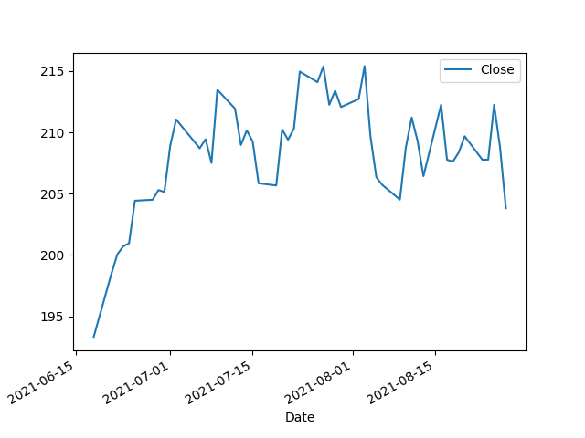
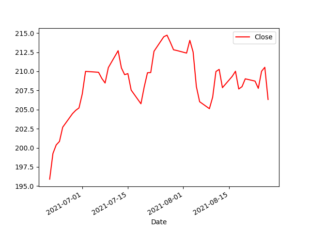
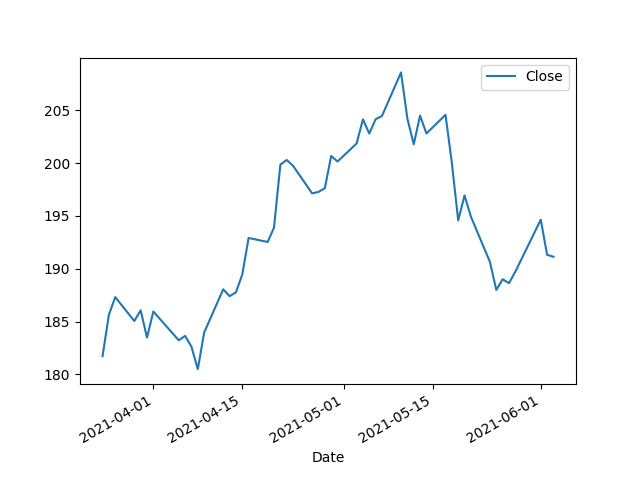
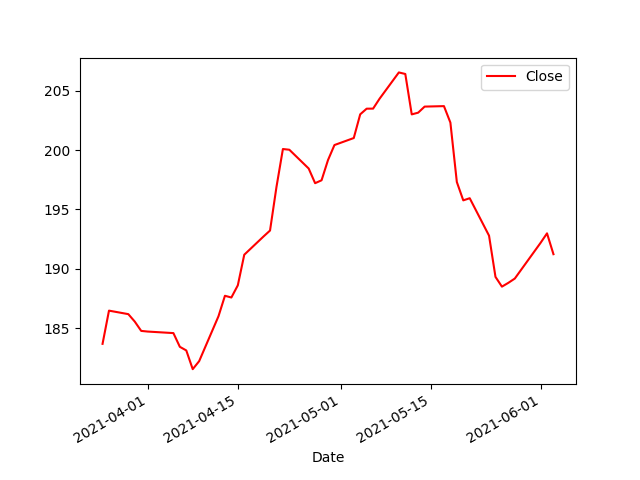
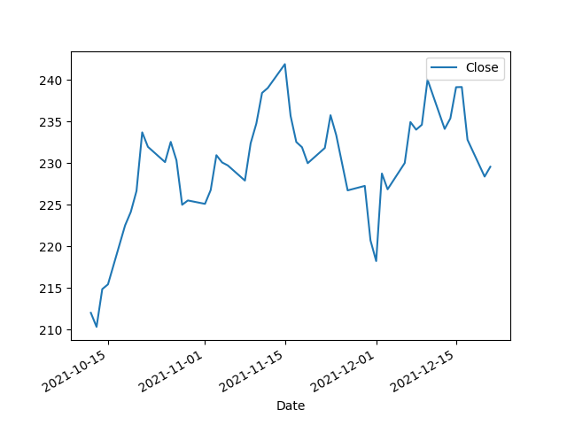
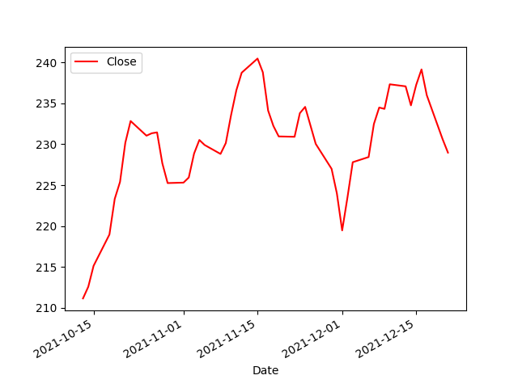
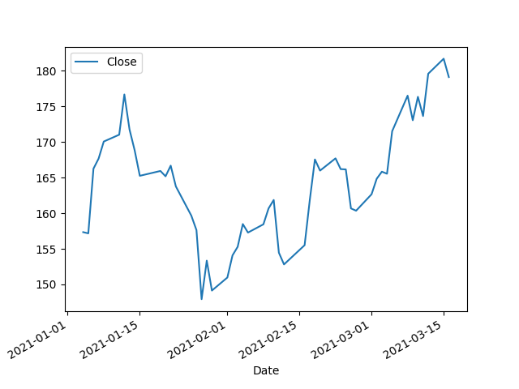
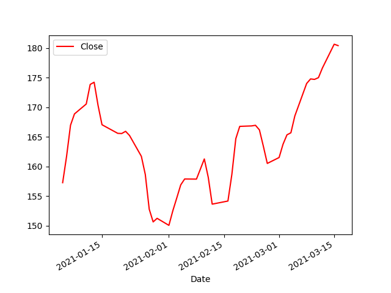

# Resultados TFG provisionales 19/05/2022

En el directorio 'Fotos/' se encuentran todos los patrones que forman la base de datos  
*Ignorar los ficheros que empiezan por AAP_...*

## Resultados de Accuracy

Se creó una base de datos Test, formada por *50* patrones definidos como doble techo, y *50* como resto.

Se escogieron aleatoriamente 10 patrones para el training set, y los otros 40 restantes para el testing set.
Esta operación de escoger los sets aleatoriamente se repitió diez veces y se calculó una media de los resultados de estos tests.

Los resultados según el tamaño de la ventana* fueron los siguientes:

- Tamaño 20: 0.73 accuracy
- Tamaño 32: 0.75 accuracy
- Tamaño 37: 0.8 accuracy
- Tamaño 48: 0.81 accuracy
- Tamaño 60: 0.83 accuracy

\* Estos tamaños de ventana fueron escogidos antes de añadir los 50 ejemplos distintos de patrones doble techo, por lo que ya no pertenecen a los cuartiles.

Destacar que si ahora mismo un patrón a analizar es de tamaño 20, y la ventana de prueba es de mayor tamaño, por ejemplo, 60, el patrón a analizar se quedará en tamaño 20 y no se aumentará. Estaría bien poder aumentarlo y añadir ruido para así realizar una análisis más real de los resultados.

## Resultados de la búsqueda de patrones

Estos son algunos ejemplos de patrones encontrados durante 2021 y 2022 en APPLE:

De color azul están representados los patrones normales, y de color rojo tras pasar un smooth con tamaño de ventana de 2.

